 

  

 

# 👋 Ｈｉ　ｔｈｅｒｅ，　Ｉ＇ｍ　Ａｂｒａｍｓ

I'm a Developer focused on machine learning, data analysis, and AI integration. I have a solid foundation in software engineering, working with databases (SQL/NoSQL), version control systems etc. I learn quickly, I like to solve complex problems and work in a team. I have analytical thinking, attention to detail and strive to develop in the field of software development, especially in the direction of system or application programming

 

## 🛠️ Skills
  
  
  
  
  
  
  
  

### 🧠 Frameworks & Libraries (Python / AI / Data)
  
  
  
  
  
  
  
  
  
  
  
  

### 🌐 Web Frameworks & Libraries
  
  
  
  
  
  
  
  
  
  
### 🗄️ Databases
  
  
  

### ⚙️ Tools & DevOps
  
  
  
  
  
  
  
  
  
  
  
  
  
  
---
 

  
  

  
  

 

>  ## 🔗 Let's Connect
> 💬 You can find me and reach out through any of the platforms below:
> 
>          

